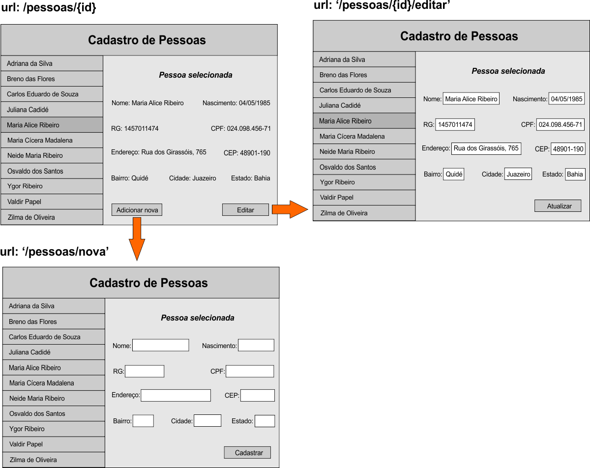

# Curso REACTJS - Desafio Cadastro de Pessoas

* Resolva o desafio utilizando a biblioteca ReactJS.

## Como participar

* Crie um novo fork e branch com seu nome-sobrenome e faça um pull request quando estiver pronto. Iremos fazer code review.

## O desafio

* Desenvolver uma aplicação web simples que gerencia um cadastro de pessoas.

## Funcionalidades que o App deve ter

* Exibir a lista de pessoas cadastradas;
* Exibir dados de uma pessoa específica;
* Editar dados de uma pessoa específica;
* Apagar uma pessoa específica do cadastro;
* Adicionar uma nova pessoa ao cadastro.

## Esboço das telas



## API
Exemplo de nome do candidato:
```
let nomeDoCandidato = 'james-da-silva'; // 
```
Exemplo de id:
```
let id = "-LM3JAJCzYqmB7JBpYmA;
```
### Incluir pessoa no cadastro
Enviar requisição POST para:
```
`https://learn-firebase-6ad07.firebaseio.com/desafio/${nomeDoCandidato}/pessoas.json`

```
Exemplo de corpo da requisição:
```
{
  "nome": "Julia Maria de Freitas",
  "nascimento": "2018-09-10T18:29:26.920Z",
  "rg": "1334081571",
  "cpf": "056.098.120-72",
  "endereco": "Rua da Mangueira, 560",
  "cep": "48901-190",
  "bairro": "Pedra do Lorde",
  "cidade": "Juazeiro",
  "estado": "Bahia"
}
```
Exemplo de retorno:
```
{
  "name": "-LM3JAJCzYqmB7JBpYmA" // id
}
```
### Consultar lista de pessoas cadastradas
Enviar requisição GET para:
```
`https://learn-firebase-6ad07.firebaseio.com/desafio/${nomeDoCandidato}/pessoas.json`

```
Exemplo de retorno:
```
{
    "-LM3JAJCzYqmB7JBpYmA": {
        "nome": "James da Silva"
    },
    "-LM3lj_kjRk6xTLkP-MZ": {
        "bairro": "Pedra do Lorde",
        "cep": "48901-190",
        "cidade": "Juazeiro",
        "cpf": "056.098.120-72",
        "endereco": "Rua da Mangueira, 560",
        "estado": "Bahia",
        "nascimento": "2018-09-10T18:29:26.920Z",
        "nome": "Jorge",
        "rg": "1334081571"
    },
    "-LM3oApEgddUQ6dtwf4a": {
        "bairro": "Areia Branca",
        "cep": "48901-190",
        "cidade": "Petrolina",
        "cpf": "056.098.120-72",
        "endereco": "Rua da Mangueira, 560",
        "estado": "Pernambuco",
        "nascimento": "2018-09-10T18:29:26.920Z",
        "nome": "James Bond",
        "rg": "1334081571"
    },
    "-LM3pYLc0Pld2vt3kIPS": {
        "bairro": "Pedra Linda",
        "cep": "48901-190",
        "cidade": "Niteroi",
        "cpf": "056.098.120-72",
        "endereco": "Rua da Mangueira, 560",
        "estado": "Rio de Janeiro",
        "nascimento": "2018-09-10T18:29:26.920Z",
        "nome": "Maria Helena",
        "rg": "1334081571"
    }
}
```
### Buscar registro de uma pessoa específica
```
`https://learn-firebase-6ad07.firebaseio.com/desafio/${nomeDoCandidato}/pessoas/${id}.json`
```
Exemplo de retorno:
```
{
  "nome": "Julia Maria de Freitas",
  "nascimento": "2018-09-10T18:29:26.920Z",
  "rg": "1334081571",
  "cpf": "056.098.120-72",
  "endereco": "Rua da Mangueira, 560",
  "cep": "48901-190",
  "bairro": "Pedra do Lorde",
  "cidade": "Juazeiro",
  "estado": "Bahia"
}
```
### Atualizar cadastro de uma pessoa específica
Enviar requisição PUT para:
```
`https://learn-firebase-6ad07.firebaseio.com/desafio/${nomeDoCandidato}/pessoas/${id}.json`

```
Exemplo de corpo da requisição:
```
{
  "nome": "Julia Maria de Freitas",
  "nascimento": "2018-09-10T18:29:26.920Z",
  "rg": "1334081571",
  "cpf": "056.098.120-72",
  "endereco": "Rua da Mangueira, 560",
  "cep": "48901-190",
  "bairro": "Pedra do Lorde",
  "cidade": "Juazeiro",
  "estado": "Bahia"
}
```
Exemplo de retorno:
```
{
  "nome": "Julia Maria de Freitas",
  "nascimento": "2018-09-10T18:29:26.920Z",
  "rg": "1334081571",
  "cpf": "056.098.120-72",
  "endereco": "Rua da Mangueira, 560",
  "cep": "48901-190",
  "bairro": "Pedra do Lorde",
  "cidade": "Juazeiro",
  "estado": "Bahia"
}
```
### Excluir uma pessoa específica do cadastro
Enviar requisição DELETE para:
```
`https://learn-firebase-6ad07.firebaseio.com/desafio/${nomeDoCandidato}/pessoas/${id}.json`

```
Exemplo de retorno:
```
null
```
